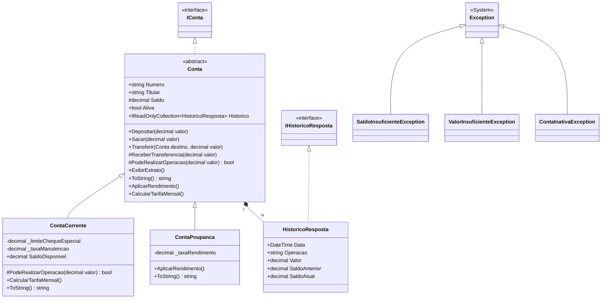
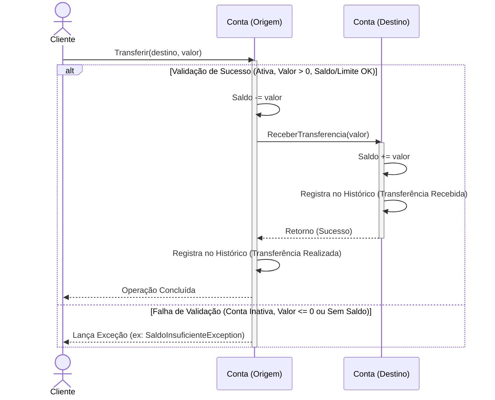
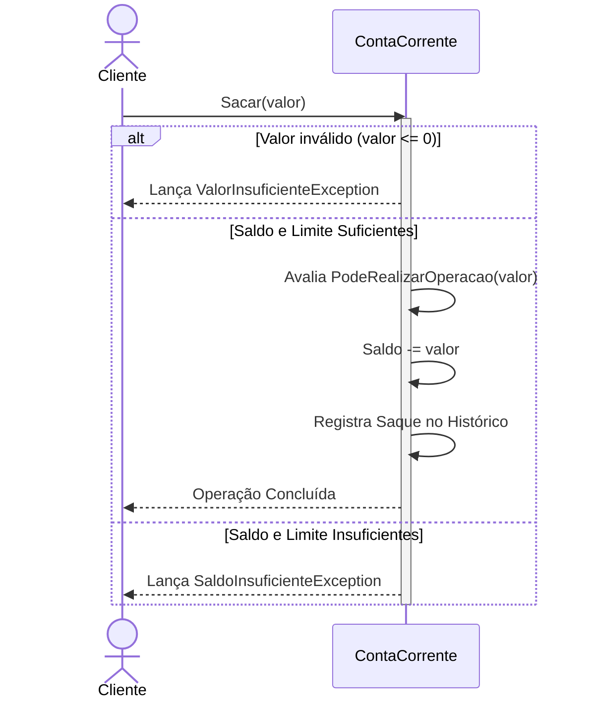
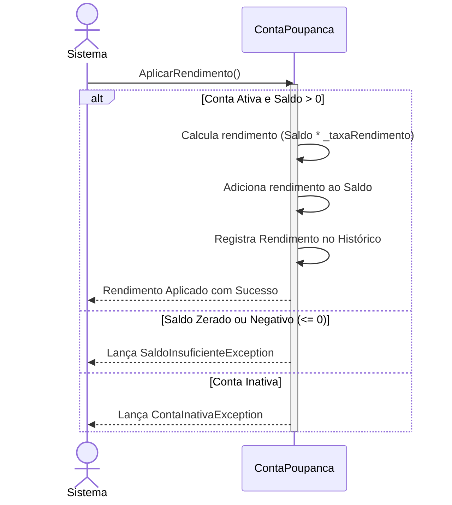

# 🏦 Sistema de Banco - C# .NET

Um sistema bancário completo e robusto desenvolvido em C# utilizando os princípios da Programação Orientada a Objetos (POO). O projeto simula operações bancárias do mundo real, incluindo gestão de contas corrente e poupança, limites de cheque especial, rendimentos, tarifas, transferências e testes unitários automatizados.

## 🛠️ Tecnologias Utilizadas

* **C#** (Linguagem de programação principal)
* **.NET SDK** (Plataforma e ecossistema de desenvolvimento)
* **Entity Framework Core** (ORM utilizado para persistência em banco de dados)
* **SQL Server** (Banco de dados relacional para armazenamento das contas e históricos)
* **xUnit** (Framework utilizado para a criação dos testes unitários)

## 🗂️ Estrutura do Projeto

A solução é dividida em três projetos principais, seguindo boas práticas de modularização e separação de responsabilidades:

```
ProjetoBanco/
│
├── 📂 ProjetoBanco.Core/
|    └── 📂 Enums/
|    |    └── 📄 TipoOperacao.cs 
|    ├── 📂 Interfaces/
|    |    ├── 📄 IConta.cs
|    |    └── 📄 IHistoricoResposta.cs
│    ├── 📂 Models/
|    |    ├── 📄 Conta.cs
│    |    ├── 📄 ContaCorrente.cs
│    |    ├── 📄 ContaPoupanca.cs
|    |    └── 📄 HistoricoResposta.cs
│    └── 📂 Exceptions/
|         ├── 📄 SaldoInsuficienteException.cs
|         ├── 📄 ValorInsuficienteException.cs
|         ├── 📄 HistoricoRespostaException.cs
|         └── 📄 ContaInativaException.cs
│
├── 📂 ProjetoBanco.Infrastructure/
|    ├── 📂 Data/
|    |    └── 📄 BancoDBContext.cs
|    └── 📂 Repositories/
|         └── 📄 ContaRepositorio.cs
│
├── 📂 ProjetoBanco.ConsoleApp/
│    └── 📄 Program.cs
│
└── 📂 ProjetoBanco.Tests/
     ├── 📄 ContaCorrenteTests.cs
     └── 📄 ContaPoupancaTests.cs
```

* **`ProjetoBanco.Core/`**: A biblioteca de classes (Class Library) principal contendo as regras e o domínio do negócio.
  * `Enums/`: Contém as enumerações utilizadas pelo sistema (`TipoOperacao`) para classificar as movimentações.
  * `Models/`: Contém as entidades centrais do sistema (`Conta`, `ContaCorrente`, `ContaPoupanca`).
  * `Exceptions/`: Contém as exceções personalizadas para o controle de domínio (`SaldoInsuficienteException`, `ValorInsuficienteException`, `ContaInativaException`, `HistoricoRespostaException`).
  * `Interfaces/`: Contém os contratos do sistema, como `IConta` e `IHistoricoResposta`.
* **`ProjetoBanco.Infrastructure/`**: Camada responsável pela persistência de dados, isolando o ORM do domínio.
  * `Data/`: Configuração principal do **Entity Framework Core** através do `BancoDBContext`, que gerencia as tabelas e heranças no banco de dados.
  * `Repositories/`: Implementações baseadas no Repository Pattern (como o `ContaRepositorio`) para centralizar as operações de CRUD.
* **`ProjetoBanco.ConsoleApp/`**: Uma aplicação de console (Console App) com o `Program.cs`. Ela serve como demonstração prática do uso do sistema, instanciando objetos, injetando dados simulados e realizando operações em tempo real para exibir extratos no console.
* **`ProjetoBanco.Tests/`**: Projeto de testes unitários utilizando o framework **xUnit**, que garante a integridade de todas as regras de negócio de depósitos, saques e exceções.


## 🗄️ Persistência de Dados e ORM

A infraestrutura utiliza o **Entity Framework Core (EF Core)** interligado ao **SQL Server**, garantindo a persistência do estado do sistema através de boas práticas:
* **Table-Per-Hierarchy (TPH):** O Contexto de Banco de Dados está configurado para salvar as entidades em TPH. Ambas as classes `ContaCorrente` e `ContaPoupanca` habitam a mesma tabela, separadas por uma coluna discriminadora chamada `TipoConta`.
* **Repository Pattern:** Consultas e manipulações no banco são centralizadas via `ContaRepositorio`, utilizando chamadas totalmente assíncronas (`async/await`) em benefício da performance e da organização do código.
* **Mapeamento em Cascata:** A relação de `Conta` possuindo muitos `HistoricoResposta` (1:N) foi definida explicitamente através da `Fluent API` para deleção em cascata e configuração restrita dos atributos no banco (ex: `HasColumnType("decimal(18,2)")`).

##  Diagrama de Classes (UML)

Abaixo está o diagrama UML que representa a estrutura principal do domínio do projeto:



## 🧩 Classes e Modelos Principais

### 1. `Conta` (Classe Base/Abstrata)
Representa a estrutura fundamental de uma conta bancária. Todas as outras contas herdam desta classe, possuindo um modelo de **Domínio Rico** (as regras de negócio estão na própria entidade, não em Services).
* **Encapsulamento Seguro:** O `Saldo` possui `protected set`, impedindo modificações externas diretas.
* **Métodos base:**
  * `Depositar(decimal valor)` e `Sacar(decimal valor)`: Manipulam os fundos validando regras através de *Early Returns* (Cláusulas de Guarda).
  * `PodeRealizarOperacao(decimal valor)`: Implementa o padrão **Template Method**. A classe base avalia o saldo real, enquanto classes filhas alteram a regra silenciosamente.
  * `Transferir(Conta destino, decimal valor)`: Orquestra a redução do saldo de origem e chama internamente o método `ReceberTransferencia` na conta de destino.
  * `ExibirExtrato()`: Imprime detalhadamente no console todo o histórico e movimentações da conta.

### 2. `ContaCorrente`
Herda de `Conta`. Representa uma conta padrão para movimentação e uso diário, com suporte a limite de crédito (cheque especial) e taxas de manutenção.
* **Atributos específicos:** `LimiteChequeEspecial`, `SaldoDisponivel` e tarifa periódica.
* **Comportamento específico:**
  * Sobrescreve apenas a regra `PodeRealizarOperacao(decimal valor)` comparando contra o `SaldoDisponivel` em vez do saldo real, reaproveitando a lógica inteira de saques e transferências da classe base (DRY - Don't Repeat Yourself).
  * `CalcularTarifaMensal()`: Deduz automaticamente a tarifa de manutenção do saldo da conta (no exemplo, o teste aponta um custo mensal que pode, inclusive, deixar a conta negativada).

### 3. `ContaPoupanca`
Herda de `Conta`. Ideal para o acúmulo de patrimônio, oferecendo taxa de juros e rendimento sobre o saldo positivo guardado.
* **Atributos específicos:** `TaxaRendimento` (em valor percentual).
* **Comportamento específico:**
  * Apenas o `Saldo` base é considerado (herança inalterada da validação `PodeRealizarOperacao`).
  * `AplicarRendimento()`: Calcula o percentual de juros sobre o saldo positivo da conta, validando ativamente possíveis exceções de conta inativa ou saldo zerado.


## 🔄 Fluxo de Transferência (Diagrama de Sequência)

Abaixo está o diagrama de sequência detalhando como ocorre a comunicação e as validações entre os objetos durante uma operação de `transferência`: 



## 🏧 Fluxo de Saque (Conta Corrente com Cheque Especial)

Este diagrama demonstra a lógica de saque na `ContaCorrente`, que verifica não apenas o saldo real, mas também o limite do cheque especial antes de aprovar a transação.



## 📈 Fluxo de Rendimento (Conta Poupança)

A operação de rendimento na `ContaPoupanca` possui condicionais importantes: a conta precisa estar ativa e possuir saldo estritamente maior que zero.




## ⚠️ Tratamento de Exceções

O sistema implementa uma camada de segurança robusta baseada em Exceções customizadas, não permitindo operações inconsistentes:
* `ValorInsuficienteException`: Disparada imediatamente caso um usuário tente depositar, sacar ou transferir valores negativos (ex: `-100m`) ou zerados (`0m`).
* `SaldoInsuficienteException`: Disparada quando a conta não possui fundos suficientes para a operação (levando em conta que a poupança usa saldo base, enquanto a corrente considera saldo + limite).
* `ContaInativaException`: Dispara caso haja problema na instanciação da propriedade `Ativa` (por padrão é `false`).
* `HistoricoRespostaException`: Disparada caso ocorra uma tentativa de inserir um registro nulo no histórico de movimentações da conta.


## 🌟 Boas Práticas Aplicadas

Durante o desenvolvimento deste projeto, foram aplicadas diversas práticas reconhecidas na engenharia de software:

* **Programação Orientada a Objetos (POO):** Uso massivo de Herança (`ContaPoupanca` e `ContaCorrente` derivando de `Conta`), Encapsulamento (controle rígido de estado interno) e Polimorfismo (sobrescrita de métodos de saque e rendimento).
* **Domínio Rico (Rich Domain):** A lógica de negócio pertence aos modelos. O estado (`Saldo`) tem a alteração blindada (`protected set`) e somente os próprios objetos são responsáveis por se manipular.
* **Tratamento de Exceções de Domínio:** Adoção de arquitetura resiliente substituindo retornos booleanos tradicionais por exceções de domínio semanticamente ricas (`SaldoInsuficienteException`, `ValorInsuficienteException`, `ContaInativaException`).
* **Template Method Pattern:** Extração da lógica polimórfica para métodos minúsculos (`PodeRealizarOperacao`), eliminando brutalmente a duplicação de código de validação entre conta corrente e poupança.
* **Testes Unitários Bem Estruturados:** Construção de testes utilizando as convenções **AAA** (Arrange, Act, Assert) estruturadas via comentários **Given, When, Then**, cobrindo o caminho feliz e casos extremos para proteger a aplicação de regressões.
* **Clean Code e Early Return:** Código legível em português, sem a pirâmide de *if/else*. Cláusulas de guarda validadas diretamente no início dos métodos aumentam a clareza.
* **Programação Assíncrona (Async/Await):** Comunicações de I/O na camada de infraestrutura (Entity Framework Core) feitas de forma assíncrona, não travando a execução da Thread primária.
* **Padrão Repository & Entity Framework:** O uso de DbContext encapsulado dentro de repositórios oculta a complexidade das queries do código de consumo, promovendo flexibilidade.


## ✅ Testes Unitários

O projeto foi construído focando em qualidade, contando com extensivos testes automatizados na pasta `ProjetoBanco.Tests`. Estão cobertos cenários como:
* **Depósitos:** Acúmulo progressivo de saldo, rejeição rigorosa de valores negativos e zeros.
* **Saques:** Atualização correta do *saldo real* vs *saldo disponível*. Testes validando o bloqueio de saques fora de limites ou saques que usam parte do limite especial.
* **Transferências:** Débito atômico na origem e crédito correto e sincronizado no destino.
* **Mecânicas Específicas:** Testes aplicando vários meses (loops) de juros na poupança e observando se o valor bate; testes cobrando mensalidade de clientes de conta corrente zerada e garantindo o uso correto do limite para cobrir a taxa.


## 🚀 Como Executar o Projeto

### Pré-requisitos
* **.NET SDK** (Recomendado 6.0 ou superior) instalado em sua máquina.
* **SQL Server** rodando localmente (via instalador ou Docker) ou remoto.

### Passo a Passo

1. Clone o repositório ou baixe o código fonte.
2. Abra o terminal na pasta raiz do projeto.
3. **Configure as Variáveis de Ambiente:** O sistema aguarda a configuração da conexão do banco de dados na variável `CONNECTION_STRING`.
   * Em ambiente Windows (CMD):
     ```bash
     set CONNECTION_STRING=Server=SEU_SERVIDOR;Database=BancoDB;Trusted_Connection=True;TrustServerCertificate=True;
     ```
   * Em ambiente PowerShell:
     ```powershell
     $env:CONNECTION_STRING="Server=SEU_SERVIDOR;Database=BancoDB;Trusted_Connection=True;TrustServerCertificate=True;"
     ```
4. **Para ver o programa funcionando na prática (Console):**
   ```bash
   cd ProjetoBanco.ConsoleApp
   dotnet run
   ```
   *O console exibirá criações de contas, transferências sendo feitas, o impacto do cheque especial e a listagem dos extratos finais.*

5. **Para rodar a bateria de testes automatizados e validar o código:**
   ```bash
   cd ProjetoBanco.Tests
   dotnet test
   ```
   *Você verá a validação das regras de negócio atestadas como "Passed".*


## 📌 Considerações

Este projeto foi desenvolvido com foco em consolidar conhecimentos em:
- **Programação Orientada a Objetos (POO):** Abstração, herança e polimorfismo.
- **Persistência de Dados e ORM:** Configuração avançada de Entity Framework Core via Fluent API.
- **Modelagem de Domínio:** Tradução de regras de negócio reais para código (limites, tarifas, rendimentos).
- **Qualidade de Software:** Criação de testes unitários automatizados utilizando o framework xUnit.
- **Resiliência:** Tratamento robusto de erros criando exceções customizadas da aplicação.
- **Modularidade:** Separação de responsabilidades entre regras de negócio (Class Library) e interface (Console App).

## 📝 Licença
Esse projeto está sob licença. Veja o arquivo [LICENÇA](LICENSE) para mais detalhes.

---

<div align="center">
  
  **Obrigado pela visita!**  
  [Kenzo Friás](https://www.github.com/kenzofrias) © 2026
  
</div>
